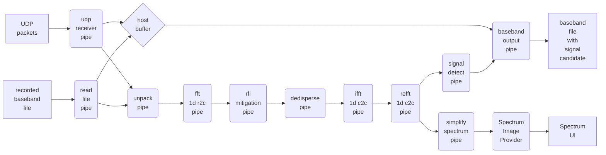

# Simple radio telescope backend
Everything working in progress...

## About this project
This is a simple backend of radio telescope. 
It reads raw "baseband" data and should be capable of coherent dedispersion, maybe in real-time.
Future plans include Fast Radio Burst (FRB) detection and maybe pulsar folding.

Due to vendor neutrality and current status of some heterogeneous computing APIs (I mean OpenCL, IMHO),
**[SYCL 2020](https://www.khronos.org/sycl/)** from Khronos Group is chosen as target API.

Although say so, currently only CPU (OpenMP, on amd64), ROCm and CUDA backends are tested, due to limited device types available.

## Building
Note that this repository has submodule for dependency manegement, don't forget to add `--recursive` when clonning this git repo, or use
```bash
git submodule update --init
```
if you have clonned this repo.

Then please refer to BUILDING.md

## Code structure
### Pipeline Structure


### FIles
* `userspace/include/srtb/`
  * `config`: compile-time and runtime configurations
  * `work`: defines input of each pipe
  * `global_variables`: stores *almost* all global variables, mainly work queues of pipes (TODO: better ways?)
  * `pipeline/`: components of the pipeline
    * each pipe defines its input work type in `work.hpp`, reads work from the `work_queue` defined in `global_variables.hpp`, do some transformations on the data, and wrap it as the work type of next pipe.
  * `fft/`: wrappers of FFT libraries like fftw, cufft and hipfft
  * `gui/`: user interface to show spectrum, based on Qt5
  * `io/`: read raw "baseband" data
    * `udp_receiver`: from UDP packets using Boost.Asio
    * `file`: from file
    * `rdma`: (TODO, is this needed?) maybe operate a custom driver to read data from network device, then directly transfer to GPU using Direct Memory Access or PCIe Peer to Peer or something like this.
  * others function as their name indicates
* `userspace/src/`: `main` starts pipes required.
* `userspace/tests/`: test component shown above.
* kernel modules was planned for performance but... needs futher discussion.

## License
Main part of this program is licensed under [Mulan Public License, Version 2](http://license.coscl.org.cn/MulanPubL-2.0/index.html) .  

Please notice that Mulan Public License (MulanPubL) is different from Mulan Permissive License (MulanPSL). The former, which this project uses, is more of GPL-like.

## Credits
This repo also contains some 3rd-party code:
* `exprgrammar.hpp` from [Suzerain](https://bitbucket.org/RhysU/suzerain) by RhysU, licensed under [Mozilla Public License, v. 2.0](https://mozilla.org/MPL/2.0/) . 
  * Tiny modification is made to update path of header included.
* [matplotlib-cpp](https://github.com/lava/matplotlib-cpp) by Benno Evers ("lava"), licensed under the MIT License
