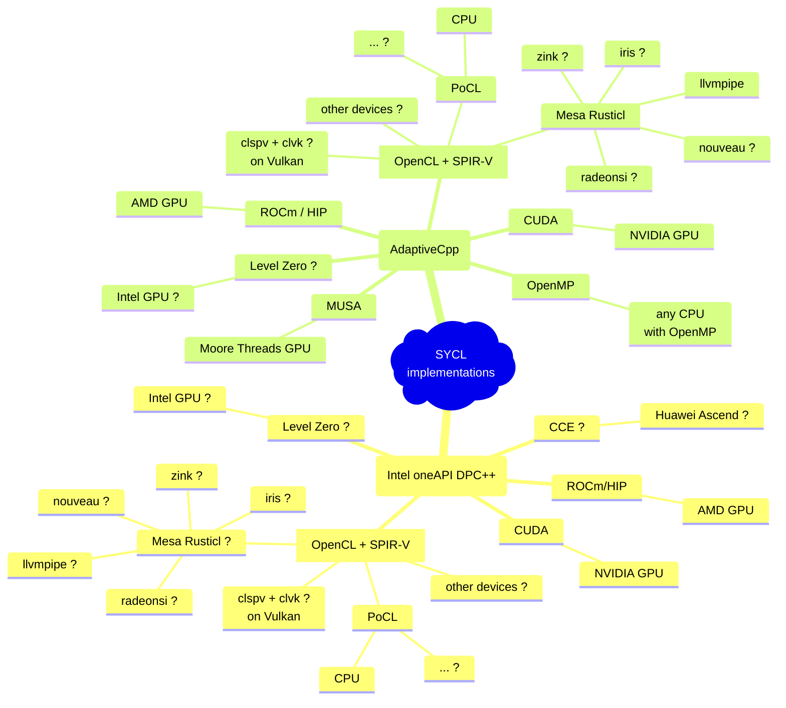

# Simple radio telescope backend
Everything working in progress...

## About this project
This is a simple backend of radio telescope. 
It reads raw "baseband"/"intermediate frequency" voltage data and should be capable of coherent dedispersion, radio frequency interference mitigation and single pulse signal detection in real-time, with spectrum waterfall shown in GUI.

<div align="center">


*Spectrum generated from one polarization of DSPSR's example baseband file of J1644-4559*


*First giant pulse from crab captured by this software (with obsolete spectrum generation code path)*

</div>

Possible future plans include DPDK integration, search of disperse measurements, etc.

Due to **vendor independence** and API complexity,
[SYCL 2020](https://www.khronos.org/sycl/) from Khronos Group is chosen as target API,
Mainly used SYCL implementations are [AdaptiveCpp](https://github.com/AdaptiveCpp/AdaptiveCpp) and [intel/llvm](https://github.com/intel/llvm/).
Tested setups are listed below.

> There do exist other GPGPUs, not only NVIDIA CUDA.

Name of this project is inspired by SDDM: Simple Desktop Display Manager.

This is only an undergraduate "research" project, so many things are naively implemented. 
Corrections and suggestions are very appreciated!

### Pipeline Structure


## Compatibility
### Example Setup



*Schemantic of main SYCL implementations and theirs backends. Devices marked "?" have not been successfully tested.*

Tested setup:

| SYCL implementation | Backend      |                         | Device Arch         | Deive Name                                                                            |
|:--------------------|:-------------|:------------------------|:--------------------|:--------------------------------------------------------------------------------------|
| AdaptiveCpp         | HIP/ROCm     |                         | gfx906              | AMD Radeon VII                                                                        |
| AdaptiveCpp         | HIP/ROCm     |                         | gfx1035             | AMD Radeon 680M [4]                                                                   |
| AdaptiveCpp         | HIP/ROCm     |                         | gfx1100             | AMD Radeon 7900 XTX                                                                   |
| AdaptiveCpp         | MUSA [1] [2] |                         | mp_21               | Moore Threads MTT S3000                                                               |
| AdaptiveCpp         | CUDA         |                         | sm_86               | NVIDIA A40 / RTX A4000 / 3090 / 3080                                                  |
| AdaptiveCpp         | OpenCL       | PoCL + CPU              | x86_64 zen3+        | AMD Ryzen Pro R7-6850HS                                                               |
| AdaptiveCpp         | OpenCL       | Mesa Rusticl + llvmpipe | x86_64 zen3+        | AMD Ryzen Pro R7-6850HS                                                               |
| AdaptiveCpp         | OpenMP       | CPU                     | x86_64              | AMD Ryzen Pro R7-6850HS <br/> AMD Threadripper Pro 3955W <br/> Intel Xeon Silver 4314 |
| AdaptiveCpp         | OpenMP       | CPU                     | riscv64 RV64GC virt | QEMU RISC-V 64                                                                        |
| [DATA EXPUNGED]     |              |                         |                     | “Vendor V" "Device X" [5]                                                             |
| Intel oneAPI DPC++  | HIP/ROCm     |                         | gfx906              | AMD Radeon VII                                                                        |
| Intel oneAPI DPC++  | HIP/ROCm     |                         | gfx1035             | AMD Radeon 680M [4]                                                                   |
| Intel oneAPI DPC++  | CUDA         |                         | sm_86               | NVIDIA A40                                                                            |
| Intel oneAPI DPC++  | OpenCL       | PoCL [3] + CPU          | x86_64 zen3+        | AMD Ryzen Pro R7-6850HS                                                               | 

[1] AdaptiveCpp MUSA backend [(working-in-progress)](https://github.com/AdaptiveCpp/AdaptiveCpp/pull/1095)  
[2] due to numerical error in muFFT library, cannot get correct result on certain MUSA versions  
[3] [intel/opencl-intercept-layer](https://github.com/intel/opencl-intercept-layer) used for SYCL USM -> OpenCL SVM emulation (not required for PoCL now, though):
```bash
export LD_PRELOAD=/opt/opencl-intercept-layer/lib/libOpenCL.so
export CLI_Emulate_cl_intel_unified_shared_memory=1
export CLI_SuppressLogging=1
```
[4] Integrated GPU of AMD Ryzen 6800 series.  
[5] "GPU-like accelerator". Information not available due to policy of this vendor.

Note: support of NVIDIA CUDA devices is of low priority and may be removed in the future.


## Building
Note that this repository has submodule for dependency management, don't forget to add `--recursive` when cloning this git repo, or use
```bash
git submodule update --init
```
if you have cloned this repo.

Then please refer to [BUILDING.md](BUILDING.md)


## Usage
Beside compile-time configurations (see [BUILDING.md](BUILDING.md)), 
there are also runtime configurations that can be set, with priority rule
"by command-line" > "by config file" > "default value"

An example config file is at `userspace/srtb_config.cfg`; meanings of these
variables are in `--help` option, `srtb/config.cpp` and `srtb/program_options.hpp`.

<details>
<summary><b>Current output of <code>--help</code></b></summary>

```
➜  src ./simple-radio-telescope-backend --help
[ 0.000788] I: [program_options] Command line options:
Options:

Command Line Only Options:
  -h [ --help ]                         Show help message
  --config_file_name arg                Path to config file to be used to read 
                                        other configs. 

Options available in config file:

General Options:
  --log_level arg                       Debug level for console log output. 
  --thread_query_work_wait_time arg     Wait time in naneseconds for a thread 
                                        to sleep if it fails to get work. Trade
                                        off between CPU usage (most are wasted)
                                        and pipeline latency. 
  --gui_enable arg                      Runtime configuration to enable GUI
  --gui_pixmap_width arg                Width of GUI spectrum pixmap
  --gui_pixmap_height arg               Height of GUI spectrum pixmap

Baseband Options:
  --baseband_input_count arg            Count of data to be transferred to GPU 
                                        for once processing, in sample counts. 
                                        Should be power of 2 so that FFT and 
                                        channelizing can work properly. 
  --baseband_input_bits arg             Length of a single input data, used in 
                                        unpack. Negative value is signed 
                                        integers. Currently supported: 
                                        1(uint1), 2(uint2), 4(uint4), 8(uint8),
                                        -8(int8), 32(float), 64(double)
  --baseband_format_type arg            Type of baseband format: 
                                        naocpsr_roach2, naocpsr_snap1, 
                                        gznupsr_a1
  --baseband_freq_low arg               Lowerest frequency of received baseband
                                        signal, in MHz. 
  --baseband_bandwidth arg              Band width of received baseband signal,
                                        in MHz. 
  --baseband_sample_rate arg            Baseband sample rate, in samples / 
                                        second. Should be 2 * 
                                        baseband_bandwidth (* 1e6 because of 
                                        unit) if Nyquist rate. 
  --baseband_reserve_sample arg         if 1, baseband data affected by 
                                        dispersion will be reserved for next 
                                        segment, i.e. segments will overlap, if
                                        possible; if 0, baseband data will not 
                                        overlap.

Data Input/Output Options:

UDP Receiver Options:
  --udp_receiver_sender_address arg     Address(es) to receive baseband UDP 
                                        packets
  --udp_receiver_sender_port arg        Port(s) to receive baseband UDP packets
  --udp_receiver_cpu_preferred arg      CPU core that UDP receiver should be 
                                        bound to. 

File Input/Output Options:
  --input_file_path arg                 Path to the binary file to be read as 
                                        baseband input. 
  --input_file_offset_bytes arg         Skip some data before reading in, 
                                        usually avoids header
  --baseband_output_file_prefix arg     Prefix of saved baseband data. Full 
                                        name will be ${prefix}${counter}.bin
  --baseband_write_all arg              if 1, record all baseband into one file
                                        per polarization; if 0, write only 
                                        those with signal detected. 

Operation Options:
  --dm arg                              Target dispersion measurement for 
                                        coherent dedispersion. 
  --fft_fftw_wisdom_path arg            Location to save fftw wisdom. 
  --mitigate_rfi_average_method_threshold arg
                                        Temporary threshold for RFI mitigation.
                                        Frequency channels with signal stronger
                                        than (this threshold * average 
                                        strength) will be set to 0
  --mitigate_rfi_spectral_kurtosis_threshold arg
                                        Frequency channels with spectral 
                                        kurtosis larger than this threshold 
                                        will be set to 0
  --mitigate_rfi_freq_list arg          list of frequency pairs to zap/remove, 
                                        format: 11-12, 15-90, 233-235, 
                                        1176-1177 (arbitrary values)
  --spectrum_channel_count arg          Count of channels (complex numbers) in 
                                        spectrum waterfall. Time resolution for
                                        one bin is 2 * spectrum_channel_count /
                                        baseband_sample_rate
  --signal_detect_signal_noise_threshold arg
                                        threshold for signal detect, target 
                                        signal / noise ratio
  --signal_detect_channel_threshold arg threshold of ratio of non-zapped 
                                        channels. if too many channels are 
                                        zapped, result is often not correct
  --signal_detect_max_boxcar_length arg max boxcar length for signal detect

```

</details>

<details>
<summary><b>Additional steps if operating with UDP packets in real time</b></summary>

* upgrade kernel and system libraries to use newer CPU instructions
* enlarge kernel buffer for networking, e.g.

```ini
# /etc/sysctl.d/98-net.conf
net.core.rmem_max = 536870912
net.core.wmem_max = 536870912
net.core.rmem_default = 536870912
net.core.netdev_max_backlog = 5000
net.ipv4.tcp_window_scaling = 1
net.ipv4.udp_rmem_min = 8388608
```

* check MTU setting of network interface
* move network interface and GPU to same NUMA node, topology can be viewed using tools like `lstopo` from hwloc
* force running on this NUMA node ("`$NODE`") using `numactl` & set process priority (nice value, "`$NICE`"):
```bash
sudo numactl --preferred $NODE nice $NICE simple-radio-telescope-backend
```

* set thread affinity of baseband/IF UDP receiver thread(s), using `udp_receiver_cpu_preferred` option

</details>


## Code structure

<details>

* `userspace/include/srtb/`
  * `config`: compile-time and runtime configurations
  * `work`: defines input of each pipe
  * `global_variables`: stores *almost* all global variables, mainly work queues of pipes (TODO: better ways?)
  * `pipeline/`: components of the pipeline
    * each pipe defines its input work type in `work.hpp`, reads work from the `work_queue`, do some transformations on the data, and wrap it as the work type of next pipe.
  * `fft/`: wrappers of FFT libraries like fftw, cufft and hipfft
  * `gui/`: user interface to show spectrum, based on Qt5
  * `io/`: read raw "baseband" data
    * `udp_receiver`: from UDP packets using Boost.Asio
    * `rdma`: (TODO, is this needed?) maybe operate a custom driver to read data from network device, then directly transfer to GPU using Direct Memory Access or PCIe Peer to Peer or something like this.
  * others function as their name indicates
* `userspace/src/`: `main` starts pipes required.
* `userspace/tests/`: test component shown above.
* kernel modules was planned for performance but... needs futher discussion.

</details>

## License
Main part of this program is licensed under [Mulan Public License, Version 2](https://license.coscl.org.cn/MulanPubL-2.0) .  

Please notice that Mulan Public License (MulanPubL) is different from Mulan Permissive License (MulanPSL). The former, which this project uses, is more of GPL-like.

Note: In accordance with the license, no contributor will be liable for any damaged caused by this program.
A device failure has been encountered during daily observation using Intel server CPU + NVIDIA server GPU setup, although a reboot simply fixed it.
Please pay special attention to server cooling before observation.

## Credits
This repo uses 3rd-party code, including:
* a [modified version](https://github.com/fxzjshm/SyclParallelSTL) of [SyclParallelSTL](https://github.com/KhronosGroup/SyclParallelSTL)
  * modified so that algorithms work direcly on input iterators
  * refer to its README for detailed modifications
* [SyclCPLX](https://github.com/argonne-lcf/SyclCPLX), licensed under [Apache License 2.0](https://github.com/argonne-lcf/SyclCPLX/blob/main/LICENSE)
* `exprgrammar.hpp` from [Suzerain](https://bitbucket.org/RhysU/suzerain) (and [this blog](https://agentzlerich.blogspot.com/2011/06/using-boost-spirit-21-to-evaluate.html)) by RhysU, licensed under [Mozilla Public License, v. 2.0](https://mozilla.org/MPL/2.0/) . 
  * Tiny modification is made to update path of header included.
* [Emulated double precision Double single routine header](https://forums.developer.nvidia.com/t/emulated-double-precision-double-single-routine-header/4686) by StickGuy, Norbert Juffa, Reimar, et al. , 
  * original code in dsmath.h; changes are made and renamed to dsmath_sycl.h to integrate into this project
  * `-ffp-contract=on` required for CUDA in order to function well
* [matplotlib-cpp](https://github.com/lava/matplotlib-cpp) by Benno Evers ("lava"), licensed under [the MIT License](https://github.com/lava/matplotlib-cpp/blob/master/LICENSE)
* [cnpy](https://github.com/rogersce/cnpy) by rogersce, licensed under [the MIT License](https://github.com/rogersce/cnpy/blob/master/LICENSE)
* [code snippet to get unmangled type name](https://bitwizeshift.github.io/posts/2021/03/09/getting-an-unmangled-type-name-at-compile-time/) by bitwizeshift, licensed under the [MIT License](https://github.com/bitwizeshift/bitwizeshift.github.io/blob/source/LICENSE).
* [concurrentqueue](https://github.com/cameron314/concurrentqueue/) by cameron314, licensed under [Simplified BSD License or Boost Software License](https://github.com/cameron314/concurrentqueue/blob/master/LICENSE.md)
