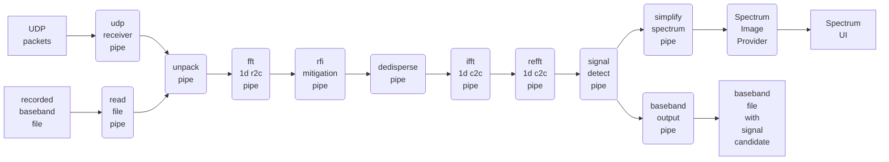

# Simple radio telescope backend
Everything working in progress...

## About this project
This is a simple backend of radio telescope. 
It reads raw "baseband"/"intermediate frequency" voltage data and should be capable of coherent dedispersion, radio frequency interference mitigation and single pulse signal detection in real-time, with spectrum waterfall shown in GUI.

Possible future plans include DPDK integration, search of disperse measurements, correction of antenna polarizations, pulsar folding backend, etc.

Due to **vendor neutrality** and API complexity,
[SYCL 2020](https://www.khronos.org/sycl/) from Khronos Group is chosen as target API.
Although say so, currently only CPU (OpenMP, on amd64), ROCm and CUDA backends are tested, due to limited device types available; another backend is working-in-progress.
Mainly used SYCL implementations are [hipSYCL](https://github.com/illuhad/hipSYCL) and [intel/llvm](https://github.com/intel/llvm/)

> It is noticed that there has been a tendency to equate GPU with CUDA, especially in HPC and AI.  
> It must be emphasized that GPU != CUDA, there do exist other vendors that should not be neglected.

This is only an undergraduate "research" project written by a newbie of radio astronomy, so many things are naively implemented. 
Corrections and suggestions are very appreciated!

## Building
Note that this repository has submodule for dependency management, don't forget to add `--recursive` when cloning this git repo, or use
```bash
git submodule update --init
```
if you have cloned this repo.

Then please refer to [BUILDING.md](BUILDING.md)

### Example Setup
Tested setup:
* AMD Rembrandt CPU + AMD GPU (gfx906; gfx1035)
  * with hipSYCL HIP backend & intel/llvm HIP backend
  * hipfft interop disabled for gfx1035 due to Segmentation Fault (as it is unsupported hardware)
* Intel Ice Lake CPU + NVIDIA GPU (GA102; GA104)
  * with hipSYCL CUDA backend & intel/llvm CUDA backend
* Intel Ice Lake CPU
  * with hipSYCL CPU backend (CBS enabled)
  * may extended to any CPU with C++ support
* AMD Rembrandt CPU
  * same as above
  * also with intel/llvm OpenCL SPIR-V backend + [intel/opencl-intercept-layer](https://github.com/intel/opencl-intercept-layer) + [PoCL](http://portablecl.org/) CPU backend
    * intel/opencl-intercept-layer used for USM -> SVM emulation:
```bash
export LD_PRELOAD=/opt/opencl-intercept-layer/lib/libOpenCL.so
export CLI_Emulate_cl_intel_unified_shared_memory=1
export CLI_SuppressLogging=1
```
* [DATA EXPUNGED] CPU + [DATA EXPUNGED] ([DATA EXPUNGED])

To be tested:
* mesa rusticl!
* Intel/AMD server/laptop CPU + [DATA EXPUNGED]

Tested NOT supported:
* Codeplay ComputeCpp Experimental 2.11
  * header not compatible with C++20
  * segmentation fault in runtime library, not open-source so no way to debug

## Usage
Beside compile-time configurations (see [BUILDING.md](BUILDING.md)), 
there are also runtime configurations that can be input with priority 
by command-line > by config file > default value

An example config file is at `userspace/srtb_config.cfg`; meanings of these
variables are in `srtb/config.cpp` and `srtb/program_options.hpp`, `--help` option can also be used.

Current output of `--help`:

```
➜  src ./simple-radio-telescope-backend --help
[ 0.000788] I: [program_options] Command line options:
Options:

Command Line Only Options:
  -h [ --help ]                         Show help message
  --config_file_name arg                Path to config file to be used to read 
                                        other configs. 

Options available in config file:

General Options:
  --log_level arg                       Debug level for console log output. 
  --thread_query_work_wait_time arg     Wait time in naneseconds for a thread 
                                        to sleep if it fails to get work. Trade
                                        off between CPU usage (most are wasted)
                                        and pipeline latency. 
  --gui_enable arg                      Runtime configuration to enable GUI

Baseband Options:
  --baseband_input_count arg            Count of data to be transferred to GPU 
                                        for once processing, in sample counts. 
                                        Should be power of 2 so that FFT and 
                                        channelizing can work properly. 
  --baseband_input_bits arg             Length of a single input data, used in 
                                        unpack. Negative value is signed 
                                        integers. Currently supported: 
                                        1(uint1), 2(uint2), 4(uint4), 8(uint8),
                                        -8(int8), 32(float), 64(double)
  --baseband_freq_low arg               Lowerest frequency of received baseband
                                        signal, in MHz. 
  --baseband_bandwidth arg              Band width of received baseband signal,
                                        in MHz. 
  --baseband_sample_rate arg            Baseband sample rate, in samples / 
                                        second. Should be 2 * 
                                        baseband_bandwidth (* 1e6 because of 
                                        unit) if Nyquist rate. 

Data Input/Output Options:

UDP Receiver Options:
  --udp_receiver_sender_address arg     Address(es) to receive baseband UDP 
                                        packets
  --udp_receiver_sender_port arg        Port(s) to receive baseband UDP packets
  --udp_receiver_cpu_preferred arg      CPU core that UDP receiver should be 
                                        bound to. 

File Input/Output Options:
  --input_file_path arg                 Path to the binary file to be read as 
                                        baseband input. 
  --input_file_offset_bytes arg         Skip some data before reading in, 
                                        usually avoids header
  --baseband_output_file_prefix arg     Prefix of saved baseband data. Full 
                                        name will be ${prefix}${counter}.bin
  --baseband_write_all arg              if 1, record all baseband into one file
                                        per polarization; if 0, write only 
                                        those with signal detected. 

Operation Options:
  --dm arg                              Target dispersion measurement for 
                                        coherent dedispersion. 
  --fft_fftw_wisdom_path arg            Location to save fftw wisdom. 
  --mitigate_rfi_average_method_threshold arg
                                        Temporary threshold for RFI mitigation.
                                        Frequency channels with signal stronger
                                        than (this threshold * average 
                                        strength) will be set to 0
  --mitigate_rfi_spectral_kurtosis_threshold arg
                                        Frequency channels with spectral 
                                        kurtosis larger than this threshold 
                                        will be set to 0
  --mitigate_rfi_freq_list arg          list of frequency pairs to zap/remove, 
                                        format: 11-12, 15-90, 233-235, 
                                        1176-1177 (arbitrary values)
  --spectrum_channel_count arg          Count of channels (complex numbers) in 
                                        spectrum waterfall. Time resolution for
                                        one bin is 2 * spectrum_channel_count /
                                        baseband_sample_rate
  --signal_detect_signal_noise_threshold arg
                                        threshold for signal detect, target 
                                        signal / noise ratio
  --signal_detect_channel_threshold arg threshold of ratio of non-zapped 
                                        channels. if too many channels are 
                                        zapped, result is often not correct
  --signal_detect_max_boxcar_length arg max boxcar length for signal detect

```

<details>
<summary><b>Additional steps if operating with UDP packets in real time</b></summary>

* upgrade kernel and system libraries to use newer CPU instructions
* enlarge kernel buffer for networking, e.g.

```ini
net.core.rmem_max = 536870912
net.core.wmem_max = 536870912
net.core.rmem_default = 536870912
net.core.netdev_max_backlog = 5000
net.ipv4.tcp_window_scaling = 1
net.ipv4.udp_rmem_min = 8388608
```

* check MTU setting of NIC
* move NIC and GPU to same NUMA node, topology can be viewed using tools like `lstopo` from hwloc
* force running on this NUMA node ("`$NODE`") using `numactl` & set process priority (nice value, "`$NICE`"):
```bash
sudo numactl --preferred $NODE nice $NICE simple-radio-telescope-backend
```

* set thread affinity of baseband/IF UDP receiver thread(s), using `udp_receiver_cpu_preferred` option

</details>


## Code structure
### Pipeline Structure


### Files
<details>

* `userspace/include/srtb/`
  * `config`: compile-time and runtime configurations
  * `work`: defines input of each pipe
  * `global_variables`: stores *almost* all global variables, mainly work queues of pipes (TODO: better ways?)
  * `pipeline/`: components of the pipeline
    * each pipe defines its input work type in `work.hpp`, reads work from the `work_queue` defined in `global_variables.hpp`, do some transformations on the data, and wrap it as the work type of next pipe.
  * `fft/`: wrappers of FFT libraries like fftw, cufft and hipfft
  * `gui/`: user interface to show spectrum, based on Qt5
  * `io/`: read raw "baseband" data
    * `udp_receiver`: from UDP packets using Boost.Asio
    * `rdma`: (TODO, is this needed?) maybe operate a custom driver to read data from network device, then directly transfer to GPU using Direct Memory Access or PCIe Peer to Peer or something like this.
  * others function as their name indicates
* `userspace/src/`: `main` starts pipes required.
* `userspace/tests/`: test component shown above.
* kernel modules was planned for performance but... needs futher discussion.

</details>

## License
Main part of this program is licensed under [Mulan Public License, Version 2](https://license.coscl.org.cn/MulanPubL-2.0) .  

Please notice that Mulan Public License (MulanPubL) is different from Mulan Permissive License (MulanPSL). The former, which this project uses, is more of GPL-like.

In accordance with the license, no contributor will be liable for any damaged caused by this program.
A device failure has been encountered during daily observation using Intel server CPU + NVIDIA server GPU setup, although a reboot simply fixed it.
**Please pay special attention to server cooling before observation.**

## Credits
This repo uses some 3rd-party code:
* a [modified version](https://github.com/fxzjshm/SyclParallelSTL) of [SyclParallelSTL](https://github.com/KhronosGroup/SyclParallelSTL)
  * modified so that algorithms work direcly on input iterators
  * refer to its README for detailed modifications
* `exprgrammar.hpp` from [Suzerain](https://bitbucket.org/RhysU/suzerain) (and [this blog](https://agentzlerich.blogspot.com/2011/06/using-boost-spirit-21-to-evaluate.html)) by RhysU, licensed under [Mozilla Public License, v. 2.0](https://mozilla.org/MPL/2.0/) . 
  * Tiny modification is made to update path of header included.
* [matplotlib-cpp](https://github.com/lava/matplotlib-cpp) by Benno Evers ("lava"), licensed under the MIT License
* [code snippet to get unmangled type name](https://bitwizeshift.github.io/posts/2021/03/09/getting-an-unmangled-type-name-at-compile-time/) by bitwizeshift, licensed under the [MIT License](https://github.com/bitwizeshift/bitwizeshift.github.io/blob/source/LICENSE)
* [Emulated double precision Double single routine header](https://forums.developer.nvidia.com/t/emulated-double-precision-double-single-routine-header/4686) by StickGuy, Norbert Juffa, Reimar, et al. , 
  * original file is dsmath.h; changes are made to dsmath_sycl.h to integrate into this project.

